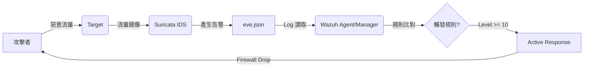

# IDS & SIEM Lab

本專案是一個基於 Docker 的整合式資安實驗環境，結合了**紅藍隊的攻擊與防禦技術**，以及**IDS (Intrusion Detection System)** 與 **SIEM (Security Information and Event Management)** 的功能。

學生可以在此 Lab 中利用紅隊攻擊技術 (如 SQL Injection, XSS, Nmap, 滲透測試等) 攻擊靶機 (Metasploitable)，並觀察 Suricata IDS 的告警紀錄。此外，Lab也整合了 Wazuh SIEM，當偵測到特定攻擊 (如 vsftpd 2.3.4 後門) 時，會觸發自動防禦機制 (Active Response)。

## 📚 核心概念與技術介紹 (Core Concepts)

### 1. IDS (Intrusion Detection System)

**入侵偵測系統** 是一種網路安全設備或軟體，用於監控網路傳輸或系統活動，以識別惡意行為或違反政策的活動。

* **功能**: 監聽流量、比對特徵 (Signature)、發出告警 (Alert)。
* **在Lab中**: **Suricata**，一套高效能的開源網路威脅偵測引擎。它會負責「看」到攻擊並紀錄下來。

### 2. SIEM (Security Information and Event Management)

**安全資訊與事件管理** 結合了 SIM (安全資訊管理) 和 SEM (安全事件管理)，提供對應用程式與網路硬體產生的安全警報進行即時分析。

* **功能**: 收集日誌 (Log Aggregation)、關聯分析(Correlation)、儀表板視覺化 (Visualization)、自動化回應 (Active Response)。
* **在Lab中**: **Wazuh** (基於 OSSEC 與 ELK Stack)，它會負責收集來自 Suricata 的告警，並在偵測到特定威脅時主動採取行動 (例如封鎖)。

## 🛠️ 系統組件詳解 (System Components Detail)

本環境由多個 Docker Container 組成，模擬一個真實的攻防場景：

### 🎯 Target (`metasploitable`)

* **角色**: 靶機
* **詳細介紹**: Metasploitable2 是一個故意設計成充滿漏洞的 Ubuntu Linux 虛擬機。它的目的是讓資安人員練習滲透測試工具與技術。
* **在Lab中**: 我們將其封裝為 Docker 容器，並開放了 HTTP (DVWA), FTP (vsftpd 2.3.4), SSH 等易受攻擊的服務。其網路堆疊與 IDS 共享，因此 IDS 可以看到所有進出此容器的流量。

### 🛡️ IDS (`suricata`)

* **角色**: 網路入侵偵測系統
* **詳細介紹**: Suricata 是一個開源的、成熟的威脅偵測引擎。它支持 IDS (入侵偵測)、IPS (入侵防禦) 和 NSM (網路安全監控)。

### 🕵️ Attacker (`attacker`)

* **角色**: 攻擊者
* **詳細介紹**: 基於 Kali Linux 的輕量級容器，安裝了常用的紅隊工具。
* **常用工具**:
  * `curl`: 發送 HTTP 請求 (測試 SQLi/XSS)。
  * `nmap`: 網路掃描與枚舉。
  * `ab` (Apache Bench): 壓力測試，用於模擬 DoS 攻擊。
  * `metasploit`: 滲透測試框架。

### 📊 Log Viewer (`evebox`)

* **角色**: IDS 日誌視覺化工具
* **詳細介紹**: Suricata 輸出的日誌格式為 EVE JSON (`eve.json`)。EveBox 是一個專門用來讀取並呈現這些日誌的 Web 介面。

### 🧠 SIEM (`wazuh`)

* **角色**: SIEM (Security Information and Event Management)
* **詳細介紹**: Wazuh 是一個龐大的生態系，在本 Lab 中拆分為三個容器：
  1. **Wazuh Manager (`wazuh.manager`)**: 核心大腦。負責接收來自 Agent (或Lab中的 IDS) 的 Log 轉送) 資料，進行解碼、過濾與規則比對。如果觸發規則 (例如偵測到 vsftpd 後門)，它會自動執行 Active Response。
  2. **Wazuh Indexer (`wazuh.indexer`)**: 資料庫。基於 OpenSearch，負責儲存與索引所有的警報與日誌資料，供快速查詢。
  3. **Wazuh Dashboard (`wazuh.dashboard`)**: 儀表板。提供 Web UI (基於 OpenSearch Dashboards)，讓管理員查看統計圖表、地圖與詳細的安全事件列表。

## 🚀 快速開始 (Quick Start)

### 1. 啟動環境

請確保已安裝 Docker Desktop，接著在專案目錄執行：

```bash
docker-compose up -d
```

等待數分鐘讓所有服務啟動完成 (Wazuh Stack 啟動較慢)。

### 2. 存取服務

* **EveBox (IDS Log)**: [https://localhost:5636](https://localhost:5636)
  * 帳號: `admin`
  * 密碼: 於容器Log內查看密碼
* **Wazuh Dashboard (SIEM)**: [https://localhost](https://localhost)
  * 帳號: `admin`
  * 密碼: `SecretPassword`
  * 注意: 由於是自簽憑證，瀏覽器可能會顯示警告，請選擇繼續前往。
* **Target Web 服務**: [http://localhost](http://localhost)
  * 帳號: `admin`
  * 密碼: `password`

## 🎯 Lab 實驗任務

此 Lab 包含以下幾個主要測試場景，對應 `suricata/rules/local.rules` 中的規則。

### 步驟 1: 進入攻擊者容器

開啟終端機，進入攻擊者容器：

```bash
docker exec -it attacker bash
```

### 步驟 2: 發動攻擊測試

#### 場景 A: Web 攻擊 (SQLi & XSS)

利用瀏覽器對 Target 發動攻擊

#### 場景 B: 偵查與 DoS

測試 Nmap 掃描與大量請求：

```bash
nmap -sS target
ab -n 100 -c 10 http://target/
```

#### 場景 C: vsftpd 2.3.4 後門滲透 (SIEM 連動)

當攻擊者嘗試利用 vsftpd 2.3.4 的笑臉後門漏洞時，SIEM 會偵測並回應。

> **漏洞簡介 (vsftpd 2.3.4 Backdoor)**:
> 這是一個歷史上著名的供應鏈攻擊案例。2011 年，駭客入侵了 vsftpd 的下載伺服器，並在 2.3.4 版本的原始碼中植入了惡意後門。
> **觸發機制**: 當使用者登入 FTP 時，若使用者名稱 (Username) 包含笑臉符號 `:)`，系統會自動在 **TCP Port 6200** 開啟一個互動式的 Root Shell，允許攻擊者直接取得系統最高權限 (Root)。

1. **觸發後門 (使用 Metasploit)**:

    在攻擊者容器中啟動 Metasploit 並執行 Exploit：

    ```bash
    msfconsole -q
    ```

    進入 msf 介面後輸入：

    ```bash
    use exploit/unix/ftp/vsftpd_234_backdoor
    set RHOST target
    exploit
    ```

    (攻擊成功後會取得一個 Root Shell)
    在Shell中輸入`hostname`應該顯示target

2. **觀察結果**:
    * **Suricata (EveBox)**: 會出現 `[NIU-LAB] vsftpd 2.3.4 Backdoor Triggered :)` (sid:10007) 的告警。
    * **Wazuh Dashboard**: 在 Security Events 中應該會看到對應的 Alert。
    * **Active Response**: SIEM 會發出 Block 訊號 (模擬封鎖)。由於 Docker 網路限制，這可能不會真的切斷所有連線，但可在 Wazuh Log 中看到觸發紀錄。

## 🔗 SIEM 關聯分析與自動防禦機制 (SIEM Correlation & Active Response)

本 Lab 的核心價值在於展示 IDS 與 SIEM 如何協同運作。以下解析從「攻擊發生」到「自動防禦」的完整技術流程。

### 1. 工作流程 (Work Flow)



### 2. 詳細邏輯解析 (Detailed Logic)

#### Step 1: 告警產生

當 Suricata 偵測到攻擊 (例如 vsftpd 後門) 時，會寫入 `eve.json`：
> `msg`: `[NIU-LAB] vsftpd 2.3.4 Backdoor Triggered :)`

#### Step 2: 規則比對 (Correlation)

Wazuh Manager 讀取 Log 並進行規則比對：

1. **父規則 (Rule 100000)**:
    * **條件**: 只要 Log 內容包含自定義的 `[NIU-LAB]` 標籤。
    * **等級**: **Level 14** (Critical)。
    * **意義**: 預設將所有自訂規則的偵測視為嚴重威脅。

2. **子規則 (例外處理)**:
    * 為了避免誤殺，我們定義了例外。
    * **Rule 100001 (Ping)**: 若包含 "ICMP Ping"，降級為 **Level 3**。
    * **Rule 100002 (Nmap)**: 若包含 "Nmap"，降級為 **Level 6**。

3. **判定結果**:
    * **vsftpd 後門**: 符合 Rule 100000，且不符合任合子規則 → 維持 **Level 14**。
    * **Nmap 掃描**: 雖符合 Rule 100000，但被 Rule 100002 覆蓋 → 最終為 **Level 6**。

#### Step 3: 自動防禦 (Active Response)
根據 `ossec.conf` 的設定：
```xml
<active-response>
  <command>firewall-drop</command>
  <location>local</location>
  <level>10</level>  <!-- 觸發門檻 -->
</active-response>
```

* 因為 **vsftpd (Level 14) >= 10**，所以**觸發**防火牆阻擋。
* 因為 **Nmap (Level 6) < 10**，所以**不觸發**阻擋 (僅紀錄)。

## 📝 自定義規則說明 (`local.rules`)

| SID | 規則名稱 | 描述 |
| :--- | :--- | :--- |
| 10001 | SQL Injection Detected | 偵測 URL 中的 UNION SELECT 關鍵字 |
| 10002 | SQL Injection - Logic Bypass | 偵測 OR ... = 邏輯繞過 |
| 10003 | XSS Attack | 偵測 `<script>` 標籤 |
| 10004 | Potential HTTP DoS | 偵測單一來源短時間內過多 HTTP請求 |
| 10005 | Nmap Scan | 偵測 Nmap 掃描特徵 |
| 10006 | ICMP Ping | 偵測 Ping 封包 |
| 10007 | vsftpd 2.3.4 Backdoor | 偵測 FTP 登入時的惡意笑臉符號 `:)` |
| 10008 | vsftpd Backdoor Shell | 偵測後門開啟後的 Shell 回應 (uid=0) |

## ❗ 常見問題

* **Wazuh 啟動很久**: 這是正常的，Elasticsearch/OpenSearch 需要較多記憶體與時間初始化。
* **SIEM沒有看到告警**: 先檢查 EveBox 是否有即時流量進來，有可能是因為 eve.json 太龐大導致 Wazuh 沒辦法解析。
* **Port 55000 Bind Error**: 若在 Windows 上遇到 `bind: An attempt was made to access a socket in a way forbidden by its access permissions`，這通常是因為 Hyper-V 保留了該 Port。
  * **解法**: 執行 `net stop winnat` 再 `net start winnat` 重置網路。
